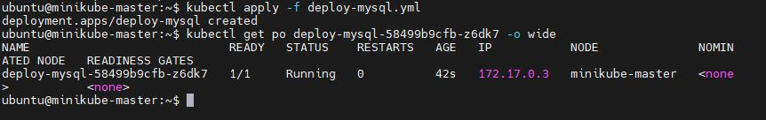
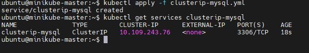
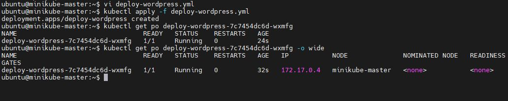
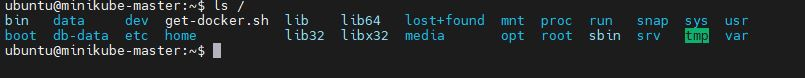
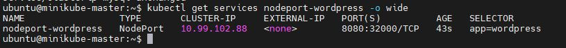
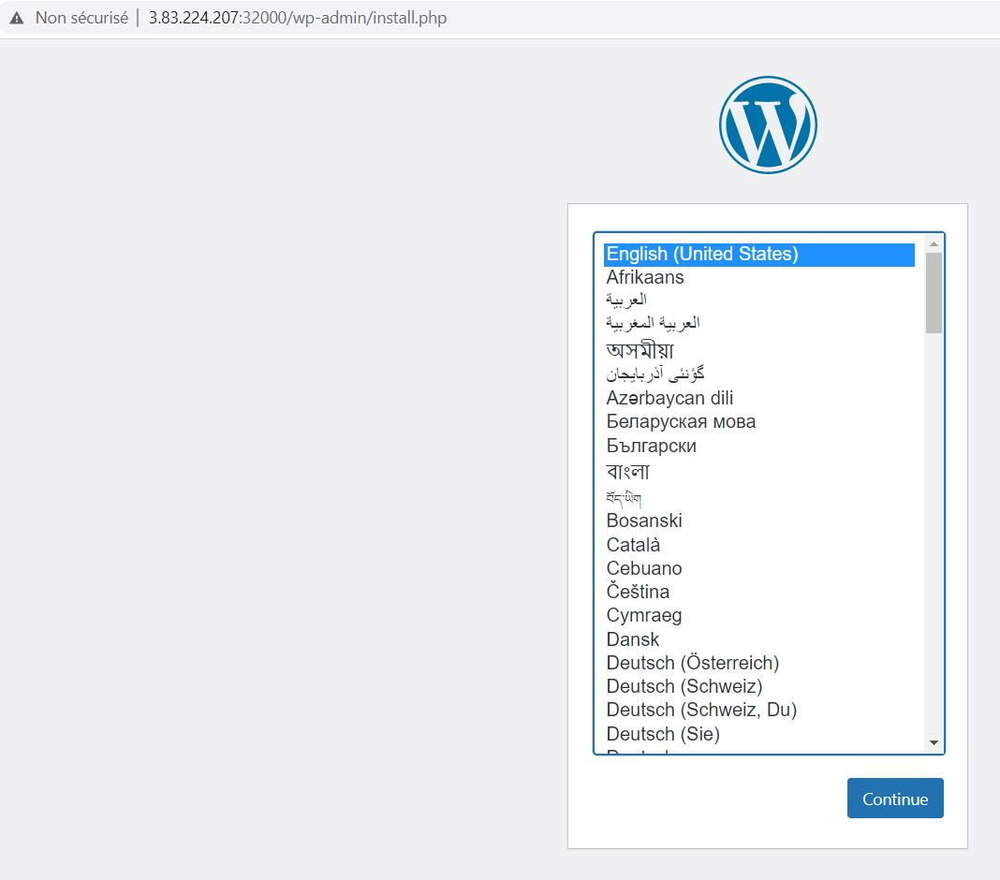
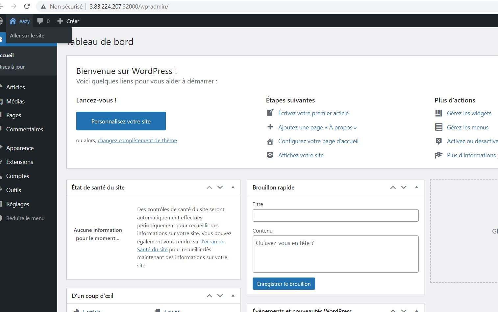

RAHMANI Abdelkader

https://github.com/kader9090/miniprojet-kubernetes.git

# Mini-projet:

# Déployer wordpress en front end et mysql en backend à l'aide de kubernetes:
# Déployement de mysql:

vi deploy-mysql.yml

```
apiVersion: apps/v1
kind: Deployment
metadata:
  name: deploy-mysql
spec:
  replicas: 1
  selector:
    matchLabels:
      app: mysql
  template:
    metadata:
      name: deploy-mysql
      labels:
        app: mysql
        formateur: Frazer
    spec:
      containers:
        - name: deploy-mysql
          image: mysql
          env:
          - name: MYSQL_DATABASE
            value: eazytraining
          - name: MYSQL_USER
            value: eazy
          - name: MYSQL_PASSWORD
            value: eazy
          - name: MYSQL_ROOT_PASSWORD
            value: password
          volumeMounts:
          - mountPath: /var/lib/mysql
            name: db-data
      volumes:
        - name: db-data
          hostPath:          
            path: /db-data
            type: DirectoryOrCreate
          
```

on lance la création
kubectl apply -f deploy-mysql.yml
on teste:
kubectl get po deploy-mysql-58499b9cfb-z6dk7 -o wide




-----------------------
je ne suis pas allé au bout de la partie secret:

secret:
echo "eazy"|base64 =>   ZWF6eQo=
echo "password"|base64  => cGFzc3dvcmQK

vi secret-mysql.yml
```
apiVersion: v1
kind: Secret
metadata:
  name: secret-mysql
type: Opaque
data:
mysql-user: ZWF6eQo=
mysql_password: ZWF6eQo=
```

-----------------------
je crée un service pour exposer en interne le deploy mysql

vi clusterip-mysql.yml
```
apiVersion: v1
kind: Service
metadata:
  name: clusterip-mysql
spec:
  type: ClusterIP
  ports:
    - targetPort: 3306
      port: 3306
  selector:
    app: mysql
```
je lance le service:
kubectl apply -f clusterip-mysql.yml


-----------------------------

# Déployement de wordpress

vi deploy-wordpress.yml

```
apiVersion: apps/v1
kind: Deployment
metadata:
  name: deploy-wordpress
spec:
  replicas: 1
  selector:
    matchLabels:
      app: wordpress
  template:
    metadata:
      name: deploy-wordpress
      labels:
        app: wordpress
        formateur: Frazer
    spec:
      containers:
        - name: deploy-wordpress
          image: wordpress
          ports:
            - containerPort: 80
          env:
          - name: WORDPRESS_DB_NAME
            value: eazytraining
          - name: WORDPRESS_DB_USER
            value: eazy
          - name: WORDPRESS_DB_PASSWORD
            value: eazy
          - name: WORDPRESS_DB_HOST
            value: clusterip-mysql
          volumeMounts:
          - mountPath: /var/www/html
            name: data
      volumes:
        - name: data
          hostPath:          
            path: /data
            type: DirectoryOrCreate
          
```
je lance la création du deploy:
kubectl apply -f deploy-wordpress.yml



je vérifie la création des deux volumes:
ls / => les deux volumes ont été bien créés : /data et /db-data

-----------------

vi nodeport-wordpress.yml
```

apiVersion: v1
kind: Service
metadata:
  name: nodeport-wordpress
spec:
  type: NodePort
  ports:
    - targetPort: 80
      port: 80
      nodePort: 32000
  selector:
    app: wordpress
```

je lance le service pour exposer wordpress en interne (vers mysql sur 80) et en externe (sur 32000)
kubectl apply -f nodeport-wordpress.yml

le port par défaut d'exposition de wordpress est 80, donc j'ai supprimé et j'ai redeployé le deploy et service wordpress avec ce port. désormais le deploy est accessible à partir d'un navifateur web




